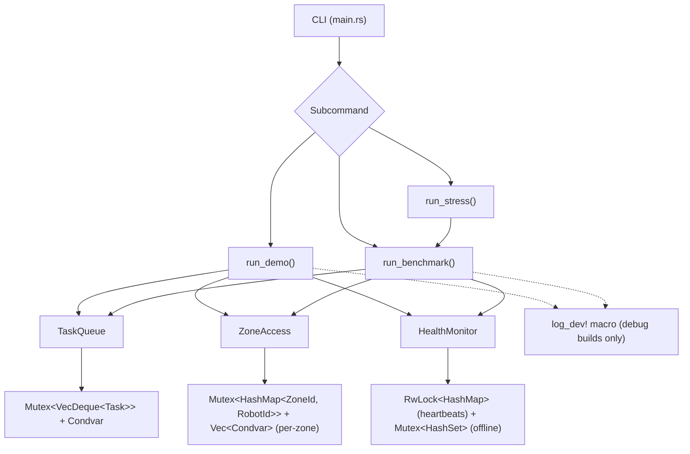
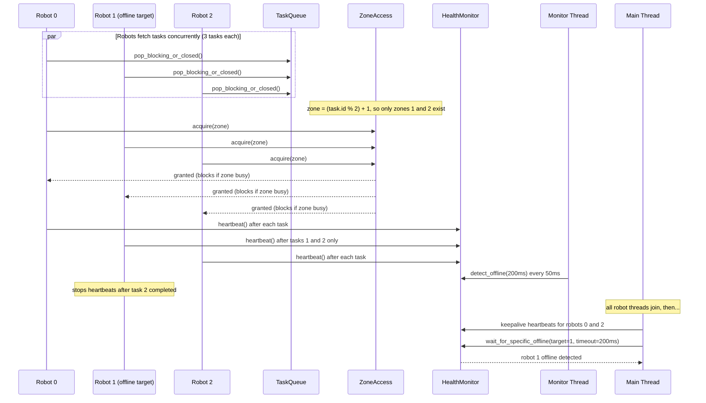
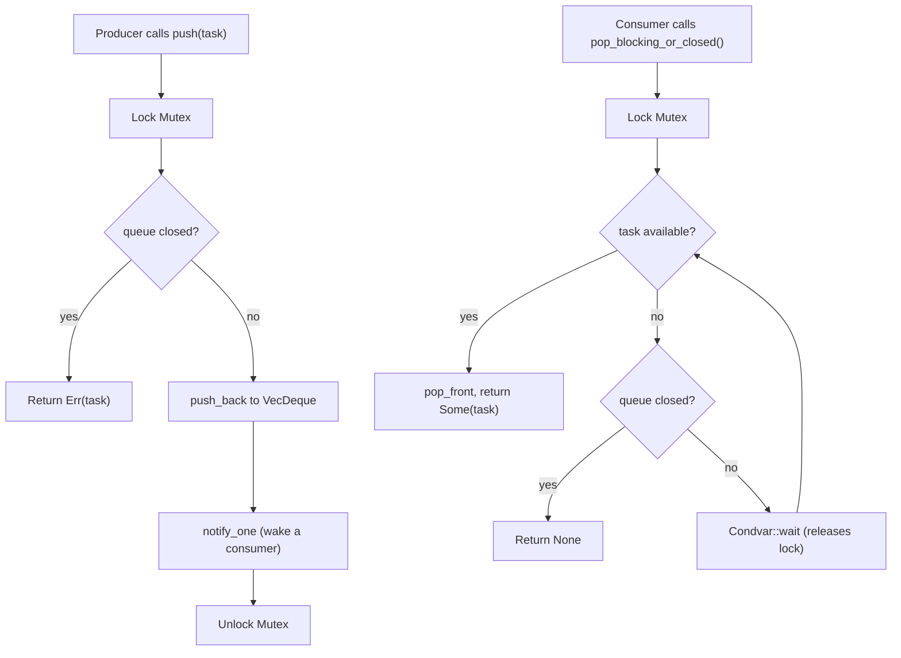
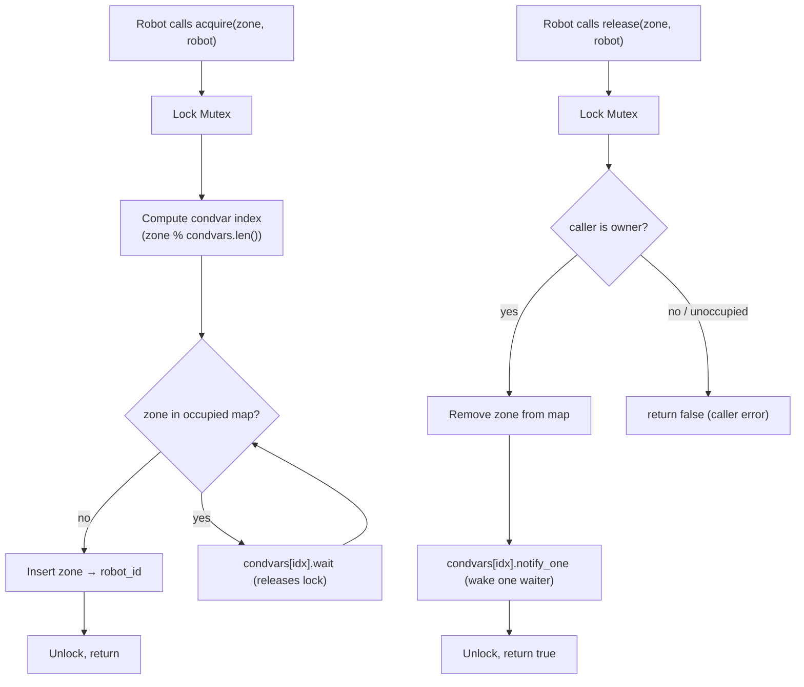
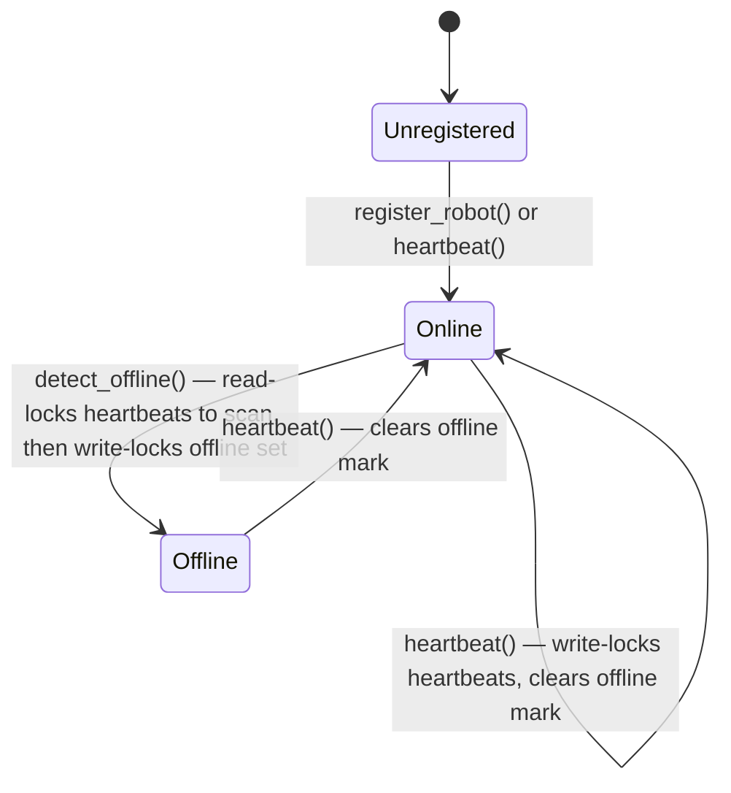
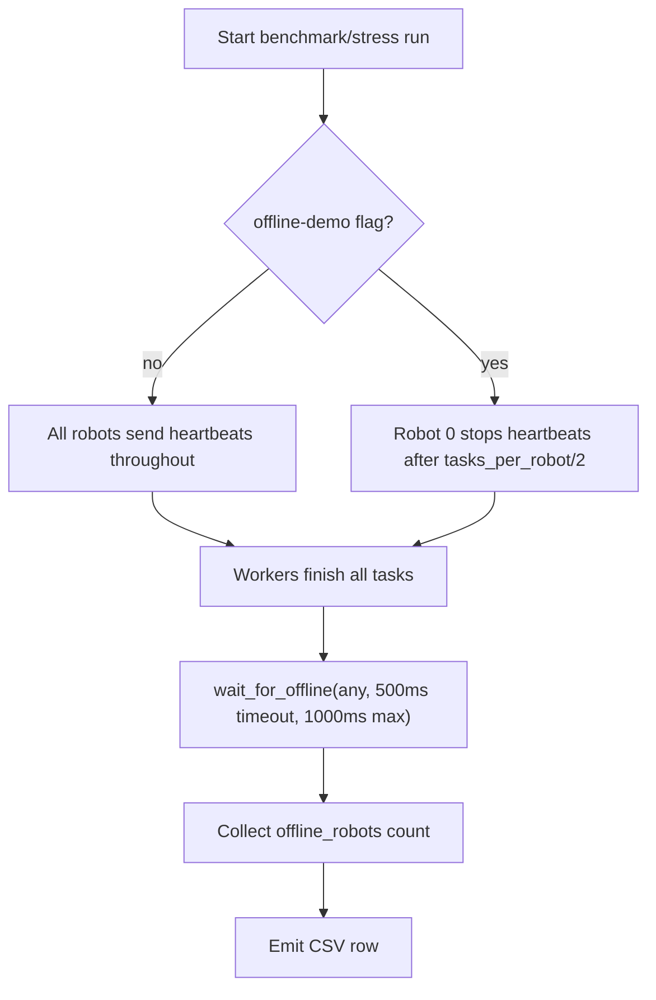

# Medical Care Robot Coordination System (MCRoCS) Diagrams

These Mermaid diagrams reflect the current implementation in:

- `src/main.rs`
- `src/sim.rs`
- `src/task_queue.rs`
- `src/zones.rs`
- `src/health_monitor.rs`

## 1) High-Level Architecture

Note: `log_dev!` emits structured logs in debug builds and is a no-op in release. It is used throughout `sim.rs` — dashed lines indicate optional/debug-only coupling. `ZoneAccess` uses per-zone `Condvar`s (indexed by `zone % len`) so `notify_one` wakes only contenders for the released zone. `HealthMonitor` uses a split-lock: `RwLock` for concurrent heartbeat reads and a separate `Mutex` for the offline set.

## 2) Demo Flow (Deterministic Offline Target)

Demo constants: `robots=3`, `tasks_per_robot=3`, `zones_total=2`, `offline_target=1`.
Robot 1 sends heartbeats only after its first 2 tasks (`stop_heartbeat_after=2`), then stops.

## 3) TaskQueue: Push and Blocking Pop

## 4) Zone Access Control

## 5) HealthMonitor State Transitions

The monitor uses a split-lock design: `RwLock<HashMap<RobotId, Instant>>` for heartbeat timestamps (allowing concurrent reads during detection) and a separate `Mutex<HashSet<RobotId>>` for the offline set.

## 6) Benchmark/Stress Offline Semantics

Interpretation:

- In demo mode, the offline target is deterministic (robot 1 stops after 2 of 3 tasks).
- In benchmark/stress offline mode, robot 0 stops heartbeats at the halfway point; `offline_robots >= 1` is expected and acceptable at run end.
