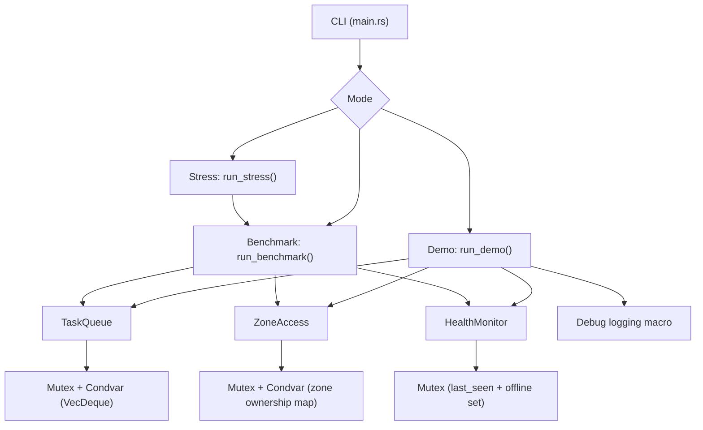
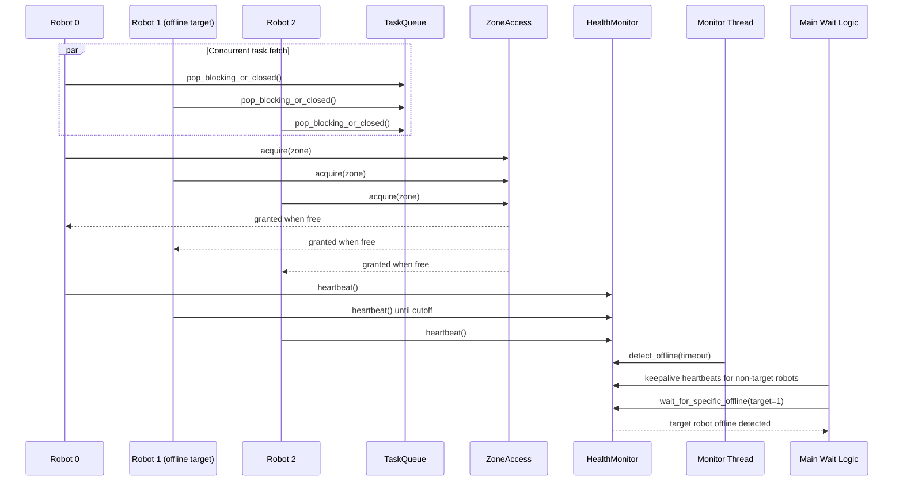
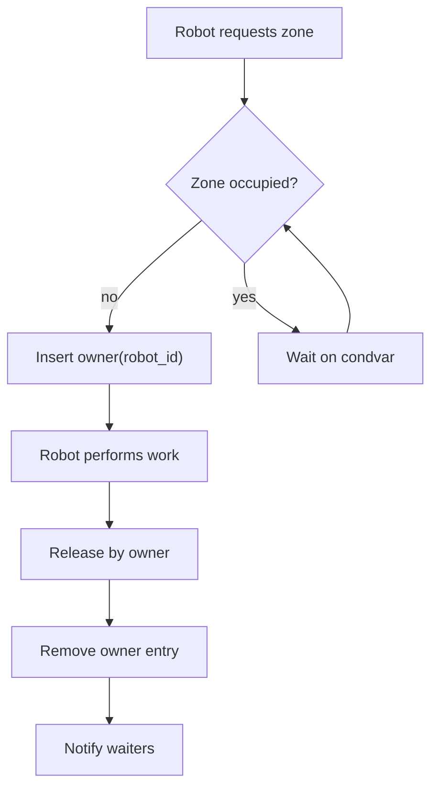
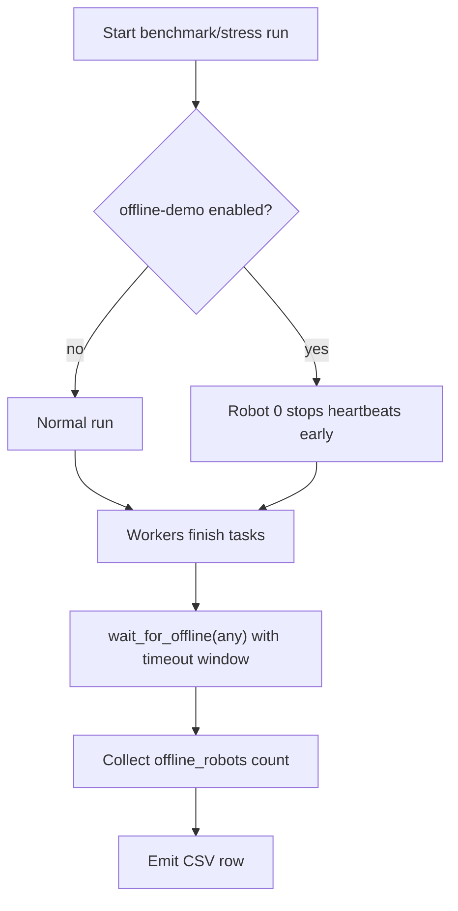

# Medical Care Robot Coordination System (MCRoCS) Diagrams

These Mermaid diagrams are aligned with the current implementation in:

- `src/main.rs`
- `src/sim.rs`
- `src/task_queue.rs`
- `src/zones.rs`
- `src/health_monitor.rs`

## 1) High-Level Architecture

## 2) Demo Flow (Deterministic Offline Target)

## 3) Zone Access Control Logic

## 4) Benchmark/Stress Offline Semantics

Interpretation note:

- In demo mode, the offline target is deterministic (`robot 1`).
- In benchmark/stress offline mode, `offline_robots` may be greater than 1 near run end; this is acceptable and expected.
